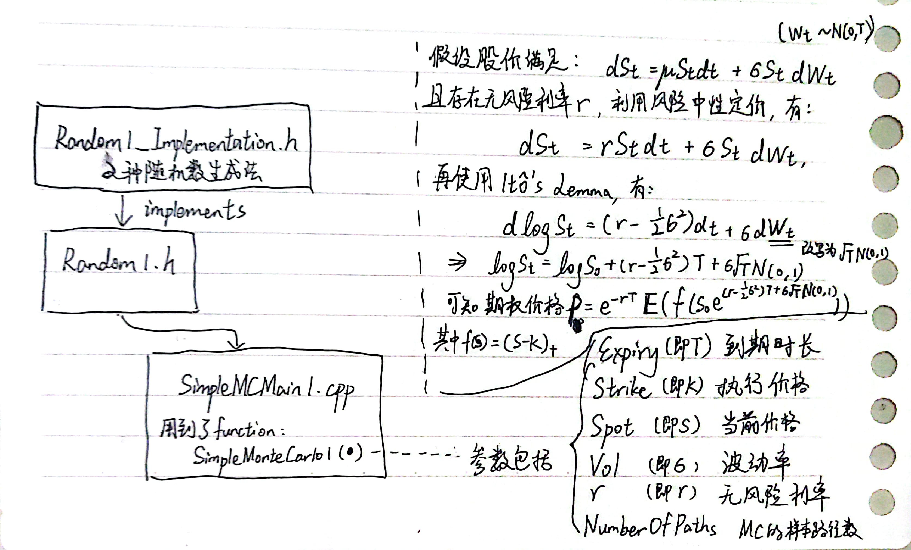

# DesignPatterns-DerivativePricing

　　本仓库用于记录笔者读完 [*C++ design patterns and derivatives pricing*](https://neodb.social/books/493600/) 后的代码实践。

## ch1-VanillaCallOption

 　　在第 1 章的文件夹里，主要实现了 1 个简单的看涨期权（call option）的定价模型，由 3 部分组成。主程序是 `SimpleMCMain1.cpp` ，其中需要用到生成随机数的功能，所以引入了 1 个头文件（只有函数声明）的 `Random1.h` ，以及具体实现该功能的头文件 `Random1_Implementation.h` [^1]。



## ch2-Encapsulation

 　　在第 2 章，对于常用的功能进行了封装。这章用到的文件具体如下（表格内省略了用于实现接口的文件，例如 “Random1_Implementation.h”，后文的表格皆是如此）：

| 文件名称          | 用途                                                         |
| :---------------- | ------------------------------------------------------------ |
| Random1.h         | 生成随机数的函数                                             |
| PayOff1.h         | 以 Strike 与 TheOptionsType 为私有变量的 PayOff 类，主要特点由：1. 以 `enum OptionType {call, put}`  区分不同类型期权的定价方式（这里是 2 种：看涨期权、看跌期权）；2. 通过`double operator() (double Spot) const` 重载运算符 `()` ，以计算给定期权的 PayOff |
| SimpleMC.h        | 用于最终定价的 Monte-Carlo 函数                              |
| SimpleMCMain2.cpp | 主程序                                                       |


## ch3-InheritanceAndVirtualFunction

　　第 2 章的程序在扩展性上有待优化，考虑以下 2 个问题：

　　第 1 个问题。如果我们现在希望引入 call, put 之外类型的期权，对其进行定价，那要怎么修改源程序呢？在上一章里，我们区分不同类型期权的 PayOff 利用了 `enum OptionType {call, put}` ，因此很容易想到的一种方法是，直接向 OptionType 添加新的类型。但是，而这东西是定义在 PayOff 类里面的，如果我们想要添加新类型，那就得修改之前写过的代码，不利于后续的维护——我们更希望后续新增的代码能“即插即用”，不需要我们为了适配新功能而调整之前的代码。

　　对于这个问题，本书的做法是采用**继承**，将我们此前实现的 PayOff 类作为基类，衍生出新的子类，如 PayOffCall 类、PayOffPut 类。

　　第 2 个问题，如果我们引入的新类型期权（比如 Double Digital Option），与之前的看涨期权、看跌期权都不一样，那怎么办？在上一章里，我们重载了运算符 `()` 以输出给定期权的 PayOff，那我是不是可以对每一个衍生出来的期权类，都重写 1 个同名函数呢？不行。在已经采用**继承**的方法下，这种思路会有些问题，不能子类与基类之间的“is-a”关系。以下面的代码为例，对于 1 个子类对象，能够调用出 2 种不同功能却同名的函数，会产生一致性问题[^2]：

```cpp
class A 
{
    public:
        void foo();
};

class B : public A 
{
	public:
    	void foo();
};

B instanceOfB;
A* ptrBase = &instanceOfB;
A* ptrDerived = &instanceOfB;

// 对于同一个类实例对象能调用出实现 2 种功能的同名函数
ptrBase -> foo(); // A::foo()
ptrDerived -> foo(); // B::foo()
```

　　那么，如果对每一个衍生出来的期权类，我都在该类里重写一个新的计算 PayOff 的函数呢？也不行。比如，PayOffCall 类里写个 `CalPayOffCall()`、PayOffPut 类里写个 `CalPayOffPut()`？如果未来还需要引入其它新类型的期权，功能相同、但个个不同名的函数一多，维护起来太麻烦，所以这样也不太好。

　　对于这个问题，本书的做法是采用**虚函数**，在 PayOff 基类中，将 `operator()` 与 析构函数 `~PayOff()` 写成虚函数。

---

　　引入**继承**与**虚函数**后，便可改写 PayOff 类，新增的文件有：

| 文件名称          | 用途                                      |
| :---------------- | ----------------------------------------- |
| PayOff2.h         | 在 PayOff1.h 的基础上，引入了继承与虚函数 |
| SimpleMC2.h       | 改动了 `#include` 的头文件，即 PayOff2.h  |
| SimpleMCMain3.cpp | 新的主程序                                |

　　此外，通过继承，我们便可实现“即插即用”。本章引入了 DoubleDigital 类作为示例。新增的文件如下：

| 文件名称          | 用途                                                         |
| ----------------- | ------------------------------------------------------------ |
| SimpleMCMain4.cpp | 在 SimpleMCMain3.cpp 的基础上，利用 if 判断期权的类型（是call？还是 put？） |
| DoubleDigital.h   | 基于 PayOff 所衍生出的 PayOffDoubleDigital 子类              |
| SimpleMCMain5.cpp | 计算 DoubleDigital 期权的主程序                              |

## ch4-BridgeWithAVirtualConstructor

鸽了，有问题可以直接看代码（？）

[^1]: 与原书相比，对于“实现接口功能”的文件的命名上，笔者采用了另外的方式。以 Random1 为例，原书中对于接口文件与实现文件的命名分别是 Random1.h 、Random1.cpp。而本仓库中则以 Random1.h 、Random1_Implementation.h 的方式命名。
[^2]:不过，这个问题其实在 PayOff 类里并不会出现，但为了设计的一致性，还是需要避免。
