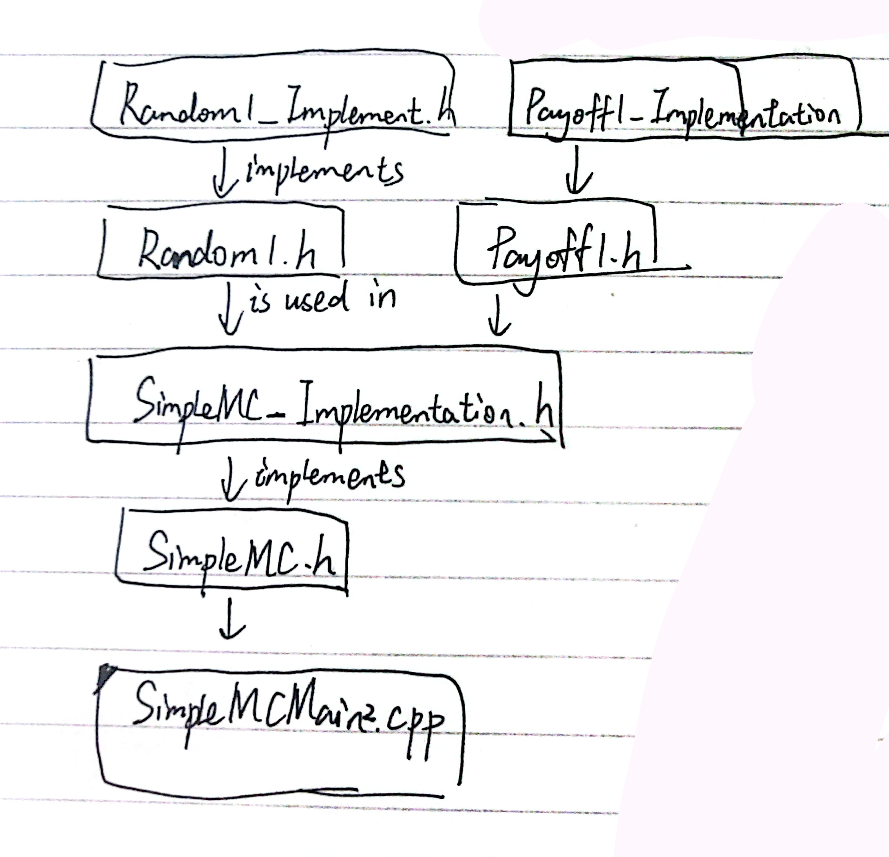

# DesignPatterns-DerivativePricing

　　本仓库用于记录笔者读完 [*C++ design patterns and derivatives pricing*](https://neodb.social/books/493600/) 后的代码实践。

## ch1-VanillaCallOption

 　　在第 2 章的文件夹里，主要实现了 1 个简单的看涨期权（call option）的定价模型，由 3 部分组成。主程序是 `SimpleMCMain1.cpp` ，其中需要用到生成随机数的功能，所以引入了 1 个头文件（只有函数声明）的 `Random1.h` ，以及具体实现该功能的头文件 `Random1_Implementation.h` [^1]。

## ch2-Encapsulation

 　　在第 2 章，对于常用的功能进行了封装。这章用到的文件具体如下（表格内省略了用于实现接口的文件，例如 “Random1_Implementation.h”，后文的表格皆是如此）：

| 文件名称   | 用途                                                         |
| :--------- | ------------------------------------------------------------ |
| Random1.h  | 生成随机数的函数                                             |
| PayOff1.h  | 以 Strike 与 TheOptionsType 为私有变量的 PayOff 类，以 `enum OptionType {call, put}`  区分不同类型期权的定价方式（这里是 2 种：看涨期权、看跌期权），计算给定期权的 PayOff |
| SimpleMC.h | 用于最终定价的 Monte-Carlo 函数                              |

## ch3-InheritanceAndVirtualFunction

　　使用虚函数方便实现多态，不需要写多个函数重载，满足了 open-closed 的原则。假设有 基类A 与 子类B，都定义了一个函数print()，分别输出"A", "B"。

[^1]: 与原书相比，对于“实现接口功能”的文件的命名上，笔者采用了另外的方式。以 Random1 为例，原书中对于接口文件与实现文件的命名分别是 Random1.h 、Random1.cpp。而本仓库中则以 Random1.h 、Random1_Implementation.h 的方式命名。

